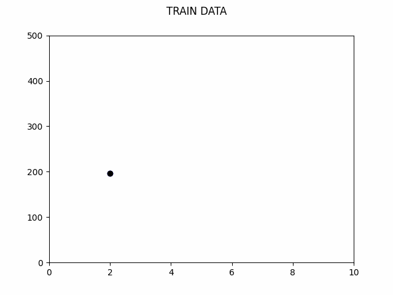
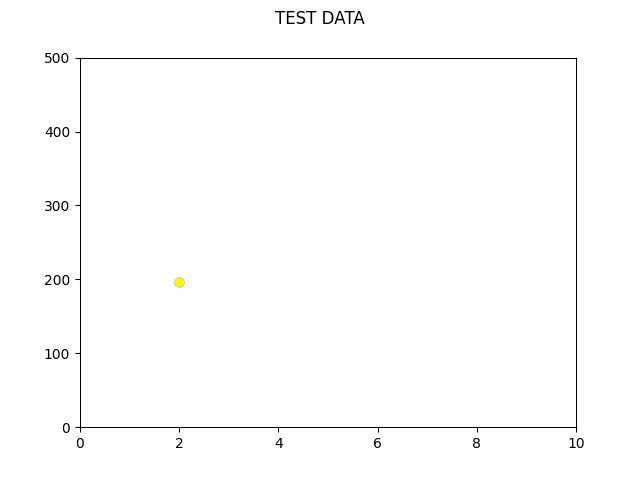

# Linear Regression
Predicting CO2 Emissions with linear regression in 1 variable with matplotlib animations.

We have 3 constraints:
<li>Engine Size</li>
<li>No. of Cylinders</li>
<li>Total Fuel Consumption</li>
 
We can use these three variable to predict the Carbon Dioxide Emission by vehicles.

The program asks the user for a input to select the constraint and uses sklearn to predict values in the test data after training the model in the training dataset. 
It plots animated graphs accordingly.

Afterwards it shows the actual and predicted values and the difference between them to help the user get an idea of the accuracy of the model.The accuracy is presented by the R2 Score which is also called the coefficient of determination.(It is the amount of the variation in the output dependent attribute which is predictable from the input independent variable(s))

The best estimation is given by the <b>Total Fuel Consumption</b> constraint (it has an R2 Score of about 0.80-0.85 which is better compared to the other 2 variables).
